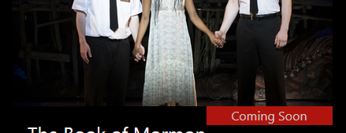

# MVC Live Project

As an intern at Prosper I.T. Consulting, I contributed to the CMS for a local theater group. The Agile project was an ASP.NET MVC web application hosted on Azure. Here are the stories I worked on and my solutions.

### Restrict Access to Productions Delete Page
If a User appends /Delete/#, where # is the ID of one of the Productions, the User gets taken to that Production's Delete page.  This means that a random User, if they are able to guess a valid ID, is currently able to delete Productions.  Fix this issue by restricting access to the Delete page so that only Users signed in as Admin can access the page.

**Solution:** 

The relevant code was in `Controllers/ProductionsController.cs`:
```c#
// GET: Productions/Delete/5
public ActionResult Delete(int? id)
{
    if (id == null)
    {
        return new HttpStatusCodeResult(HttpStatusCode.BadRequest);
    }
    Production production = db.Productions.Find(id);
    if (production == null)
    {
        return HttpNotFound();
    }
    return View(production);
}
```
My inital idea was to add a test inside the function to see if the user was logged in as Admin. This possibly messy fix was obviated thanks to a helpful suggestion that I look into data annotations. A quick search resulted in a much more elegant solution: adding a single data annotation validator attribute. Problem solved.
```c#
// GET: Productions/Delete/5
[Authorize(Roles = "Admin")]	// Prevent anyone but Admin from deleting
public ActionResult Delete(int? id)
{
    ...
}
```
---

### Production Details - Consolidate Links
At the bottom of the Production Details page, if you log in as an admin, you'll notice that a link "Edit | " appears on its own line.  That Edit link is supposed to be on the same line as the other links, like this,

`Edit | Current Productions | Back to List`

Please consolidate these links into a single line.  When you log out as an admin, "Edit | " should gracefully disappear.

**Solution:**
```c#
// "@:" renders rest of line as HTML. 
// https://docs.microsoft.com/en-us/aspnet/core/mvc/views/razor?view=aspnetcore-3.1#razor-code-blocks
<div>
  @if (ViewContext.HttpContext.User.IsInRole("Admin"))
  {
    @Html.ActionLink("Edit", "Edit", new { id = Model.ProductionId }) @:|
  }
    @Html.ActionLink("Current Productions", "Current") |
    @Html.ActionLink("Back to List", "Index")
</div>
```
---

### Fix Duplicating Awards Seeding
When you run the project, the SeedAwards method in the Startup file seeds the database with Awards.  However, if you run the project again, those same Awards are added to the database again.  Find out why the Awards are being duplicated every time the project is run and implement your solution.

**Solution:**

The following line is the culprit.
```c#
awards.ForEach(award => context.Awards.AddOrUpdate(aw => aw.AwardId, award));
```
It produces duplicate seed records every time the program is run because of the use of AwardId in AddOrUpdate(). When an Award object is instantiated, AwardId is not yet known because its value is set by the DB upon insertion. Hence, the object will always not be found, and therefore will always be added. Whereas, in the other seed methods the calls to AddOrUpdate() refer to a table column that acts as an alternate key that uniquely identifies the record. In the Awards table the compound key (Year, Name, Type, Category) serves as an alternate key.
```c#
awards.ForEach(award => context.Awards.AddOrUpdate(a => new { a.Year, a.Name, a.Type, a.Category }, award));
```
---

### Production Index - Production Ribbons

For this story you will be adding red ribbons to the production images on the Production Index page, similar to the ones on the home page, except for the fact that they will be located on the lower right corner of an image, rather than on the upper right corner.  For the production that is currently playing, the ribbon will say "Onstage".  For the productions that will play in the future, their ribbons will say "Coming Soon".  For all other productions the ribbons should not be visible.  You can make the ribbon background color slightly transparent.  The result will look like this:


**Solution:**
In Views/Productions/Index.cshtml

```c#
<div class="prod-index-ribbon-parent">
  <a href="@Url.Action("Details", "Productions", new { id = item.ProductionId })">
    
    <div class="prod-index-ribbon">
	@if (item.IsCurrent)
	{
	  @: Onstage
	}
	else if (item.OpeningDay > DateTime.Now)
	{
	  @: Coming Soon
	}
    </div>
  </a>
</div>
```

- Position ribbon so that its top edge coincides with the bottom edge of its parent.

		top: 100%;
		
		

- Position ribbon so that its right edge coincides with the right edge of its parent.

		right: 0;

		

- Rotate ribbon counter-clockwise 45 degrees pivoting at top left corner.

		transform-origin: top left;
		transform: rotate(-45deg);

		

- Calculate the horizontal distance between the top right corner of ribbon and right edge of parent. 
	
		width - width * cos(45deg)
	
- Position ribbon so that its top right corner coincides with right edge of parent. (Using the `right` property means we go in the negative direction. Simplifying algebraically and substituting the actual value of cosine gives `width * -0.293`.)

		right: calc(var(--ribbon-width) * -293);

		

Putting it all together:

```css
/* BEGIN Production Index ribbon styles */
.prod-index-ribbon-parent {
    position: relative;
    overflow: hidden;
}
.prod-index-ribbon {
    position: absolute;
    opacity: 0.8;
    text-align: center;
    background-color: var(--main-bg-color);
    color: var(--light-color);
    transform-origin: top left;
    transform: rotate(-45deg);
    --ribbon-width: 10em;
    width: var(ribbon-width) 
    /* right = -width * (1 - cos(45deg))
       If width is changed, right must be recalculated */
    right: -3em;
    right: calc()
    top: 100%;
}
/* END Production Index Ribbon styles */
```


---
