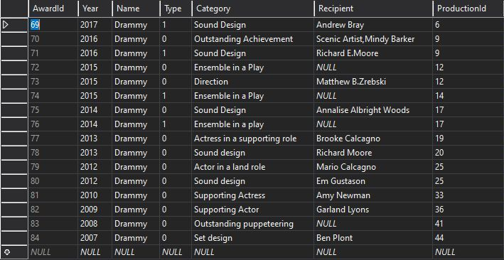
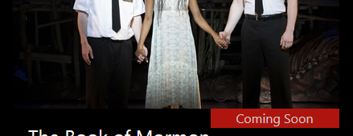
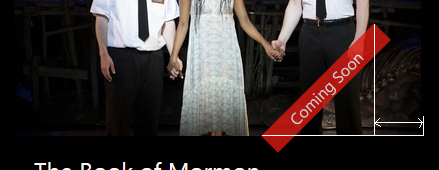

# MVC Live Project Code Summary

As an intern at Prosper I.T. Consulting, I contributed to the CMS for a local theater group. The Agile project was an ASP.NET MVC web application on Azure. Here are the stories I worked on and my solutions.

### Story 1: Restrict Access to Productions Delete Page
> If a User appends `/Delete/#`, where `#` is the ID of one of the Productions, the User gets taken to that Production's Delete page.  This means that a random User, if  they are able to guess a valid ID, is currently able to delete Productions.  Fix this issue by restricting access to the Delete page so that only Users signed in as Admin can access the page.

The code in question is the Delete method of the Productions controller. 

```c#
// GET: Productions/Delete/5
public ActionResult Delete(int? id)
{
    if (id == null)
    {
        return new HttpStatusCodeResult(HttpStatusCode.BadRequest);
    }
    Production production = db.Productions.Find(id);
    if (production == null)
    {
        return HttpNotFound();
    }
    return View(production);
}
```

My initial thought is to add some logic inside the method to see if the user is logged in as Admin. Before I can start researching my idea however, I receive a helpful suggestion to look into data annotations. A little research in the Microsoft documentation and I find the answer: a single data annotation validator attribute. Same idea but without the messy logic.

**Solution:**

```c#
[Authorize(Roles = "Admin")]	// Prevent anyone but Admin from deleting
public ActionResult Delete(int? id)
```
---
### Story 2: Production Details - Consolidate Links
> At the bottom of the Production Details page, if you log in as an admin, you'll notice that a link `"Edit | "` appears on its own line.  That Edit link is supposed to be on the same line as the other links, like this,
>
> `Edit | Current Productions | Back to List`
>
> Please consolidate these links into a single line.  When you log out as an admin, `"Edit | "` should gracefully disappear.

The relevant code for this one is in the Production Details view: 

```c#
@if (ViewContext.HttpContext.User.IsInRole("Admin"))
{
    <p>
        @Html.ActionLink("Edit", "Edit", new { id = Model.ProductionId }) |
    </p>
}
<p>
    @Html.ActionLink("Current Productions", "Current") |
    @Html.ActionLink("Back to List", "Index")
</p>
```

At first glance I see why the "Edit" text is on a separate line: it's inside a paragraph element. So I move the first opening `<p>` tag outside the `@if` block, delete both the closing `</p>` tag inside the `@if` block and the opening `<p>` tag after the `@if` block, and _Presto!_ I get a compilation error.

After unsuccessfully taking a heuristic approach involving various arrangements and orderings of HTML and Razor, I reach out to a peer and receive another friendly suggestion to look into Razor code blocks. Another quick search of the Microsoft docs leads to another simple solution and reinforces something I've learned over the years as a programmer: 

If it's not working, it's probably because I'm missing something. Sometimes a comma. Sometimes a semi-colon. And sometimes knowledge. (Usually knowledge.) 

In this particular case, it's knowledge of explicit line transitions using the `@:` syntax. More specifically, because the `|` character is inside a code block, the compiler interprets it as part of a C# expression. Using `@:` tells the compiler to render everything after it as HTML. 

**Solution:**

```c#
<p>
  @if (ViewContext.HttpContext.User.IsInRole("Admin"))
  {
    @Html.ActionLink("Edit", "Edit", new { id = Model.ProductionId }) @:|
  }
  @Html.ActionLink("Current Productions", "Current") |
  @Html.ActionLink("Back to List", "Index")
</p>
```
---

### Story 3: Fix Duplicating Awards Seeding
> When you run the project, the SeedAwards method in the Startup file seeds the database with Awards.  However, if you run the project again, those same Awards are added to the database again.  Find out why the Awards are being duplicated every time the project is run and implement your solution.

The offending code:

```c#
private void SeedAwards()
{
    var awards = new List<Award>
    {
	... // Award data to seed the database with
    };
    
    awards.ForEach(award => context.Awards.AddOrUpdate(a => a.AwardId, award));
    context.SaveChanges();
}
```

I suspect one of the last two lines is the culprit, so I gather some clues from the corresponding lines in the other seed methods.

```
SeedProductions(): 
    productions.ForEach(Production => context.Productions.AddOrUpdate(d => d.Title, Production));

SeedCastMembers(): 
    castMembers.ForEach(castMember => context.CastMembers.AddOrUpdate(c => c.Name, castMember));
```

I notice these two `AddOrUpdate()` calls don't reference the primary key like the one in `SeedAwards()` does. I look at the `Productions` and `CastMembers` tables to get some context. I see that each of the two fields, `Title` and `Name`, serves as an alternate key for their tables. 

_Why wouldn't they just use the primary key?_ I wonder. Then it hits me like a ton of bricks. The `AwardId` property in `AddOrUpdate()` is causing the duplicate seed records!

It's like this, see. When an `Award` object is instantiated, `AwardId` is not yet known because its value isn't set until after it's saved to the database. Since `AwardId` is not known, the object will always not be found, and therefore will always be added. Thing is, the `Awards` table doesn't have a single field that can be used as an alternate key by itself. 

To figure out what makes an individual award unique, I inspect the `Awards` table though my giant magnifying glass.



From this data and the list of [past years' Drammy award winners](https://drammyawards.org/past-winners/), I deduce the following:

- There are multiple Drammys given each year. 
- In any given year, there is exactly one winner in a particular category,
- And possibly a finalist in the same category.
- There may or may not be an individual recipient of the award,
- But there's always a Production associated with it.

The question is: are the `Recipient` and `ProductionId` fields necessary to identify a record? I imagine the announcer presenting the award. 

_The finalists for the 2015 Drammy for Best Ensemble in a Play are ..._ <br/>
_And the winner of the 2015 Drammy for Best Ensemble in a Play goes to ..._

I decide to go with my gut. The compound key `(Year, Name, Type, Category)` is sufficient to serve as an alternate key. An ad hoc solution? Maybe. But it gets my pull request accepted. 

Case closed.

**Solution:**

```c#
awards.ForEach(award => context.Awards.AddOrUpdate(a => new { a.Year, a.Name, a.Type, a.Category }, award));
```
---

### Story 4: Production Index - Production Ribbons

> For this story you will be adding red ribbons to the production images on the Production Index page, similar to the ones on the home page, except for the fact that they will be located on the lower right corner of an image, rather than on the upper right corner.  For the production that is currently playing, the ribbon will say "Onstage".  For the productions that will play in the future, their ribbons will say "Coming Soon".  For all other productions the ribbons should not be visible.  You can make the ribbon background color slightly transparent.  The result will look like this:
>
> 

My starting point is in the Production Index view:

```html
<a href="@Url.Action("Details", "Productions", new { id = item.ProductionId })">
  
</a>
```

In order to superimpose the ribbon over the image, I need to add an element that's a sibling of ``; this will contain the ribbon markup and logic to determine the appropriate text if any. Then I wrap all of it in a `<div>` and add class names so I can target them in CSS. 

```html
<div class="prod-index-ribbon-parent">
  <a href="@Url.Action("Details", "Productions", new { id = item.ProductionId })">
    
    <div class="prod-index-ribbon">
	@if (item.IsCurrent)
	{
	  @: Onstage
	}
	else if (item.OpeningDay > DateTime.Now)
	{
	  @: Coming Soon
	}
    </div>
  </a>
</div>
```

I set some preliminary styling, 

```css
.prod-index-ribbon-parent {
    position: relative;
}
.prod-index-ribbon {
    position: absolute;
    opacity: 0.8;
    text-align: center;
    background-color: var(--main-bg-color);
    color: var(--light-color);
    width: 10em;
}
```

and then I position the ribbon in the following steps.

- Make its top edge coincide with the bottom edge of its parent.

	```css
	top: 100%;
	```
		
	

- Make its right edge coincide with the right edge of its parent.

	```css
	right: 0;
	```

	

- Rotate it counter-clockwise 45 degrees pivoting at top left corner.

	```css
	transform-origin: top left;
	transform: rotate(-45deg);
	```

	

- Make its top right corner coincide with right edge of parent. 
    - Calculate the horizontal distance between the top right corner of ribbon and right edge of parent. 

	

    - After rotation, the horizontal distance from the top left corner to the top right corner is `width * cos(45deg)`, so from the top right corner to the right edge of parent is `width - width * cos(45deg)`.
    - Substituting the actual value of cosine, flipping the sign of the expression (using the `right` property to move right means the value must be negative), and simplifying algebraically gives `width * -0.293`.
    - Create a custom CSS property to store the width of the ribbon.

	```css
	--ribbon-width: 10em;
	width: var(--ribbon-width);
	right: calc(var(--ribbon-width) * -0.293);
	```

	

- Clip the portion of the ribbon that extends past the edges of the parent.

	```css
	overflow: hidden;
	```
		
	

**Solution:**

```css
.prod-index-ribbon-parent {
    position: relative;
    overflow: hidden;
}
.prod-index-ribbon {
    position: absolute;
    opacity: 0.8;
    text-align: center;
    background-color: var(--main-bg-color);
    color: var(--light-color);
    top: 100%;
    transform-origin: top left;
    transform: rotate(-45deg);
    --ribbon-width: 10em;
    width: var(--ribbon-width);
    right: calc(var(--ribbon-width * -0.293);
}
```


---
