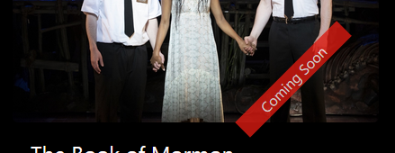
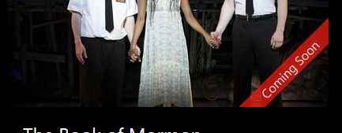

# MVC Live Project

As an intern at Prosper I.T. Consulting, I contributed to the CMS for a local theater group. The Agile project was an ASP.NET MVC web application hosted on Azure. Here are the stories I worked on and my solutions.

### Story 1: Restrict Access to Productions Delete Page
> If a User appends /Delete/#, where # is the ID of one of the Productions, the User gets taken to that Production's Delete page.  This means that a random User, if  they are able to guess a valid ID, is currently able to delete Productions.  Fix this issue by restricting access to the Delete page so that only Users signed in as Admin can access the page.

_Sounds simple enough. Just add some logic inside the method to see if the user is logged in as Admin,_ I thought as I assigned the story to myself. First, to locate the relevant code. In this case it was in the Productions controller:

```c#
// GET: Productions/Delete/5
public ActionResult Delete(int? id)
{
    if (id == null)
    {
        return new HttpStatusCodeResult(HttpStatusCode.BadRequest);
    }
    Production production = db.Productions.Find(id);
    if (production == null)
    {
        return HttpNotFound();
    }
    return View(production);
}
```

Before I could start researching my idea, I received a helpful suggestion to look into data annotations. A quick search resulted in a much simpler solution (and much more sleek, I might add): a single data annotation validator attribute.

**Solution:**

```c#
[Authorize(Roles = "Admin")]	// Prevent anyone but Admin from deleting
public ActionResult Delete(int? id)
```
---
### Story 2: Production Details - Consolidate Links
> At the bottom of the Production Details page, if you log in as an admin, you'll notice that a link `"Edit | "` appears on its own line.  That Edit link is supposed to be on the same line as the other links, like this,
>
> `Edit | Current Productions | Back to List`
>
> Please consolidate these links into a single line.  When you log out as an admin, `"Edit | "` should gracefully disappear.

I find the relevant code for this one in the Production Details view: 

```c#
@if (ViewContext.HttpContext.User.IsInRole("Admin"))
{
    <p>
        @Html.ActionLink("Edit", "Edit", new { id = Model.ProductionId }) |
    </p>
}
<p>
    @Html.ActionLink("Current Productions", "Current") |
    @Html.ActionLink("Back to List", "Index")
</p>
```

At first glance I see why the "Edit" text is on a separate line: it's inside a `<p>` element. I move the opening `p` tag outside the `@if` block, delete the first closing `p` and second opening `p` and ... _DRATS! I broke it!_

After an unsuccessful trial-and-error approach involving various arrangements and orderings of HTML and Razor, I reach out to a peer and receive another friendly suggestion to look into Razor code blocks. Another quick search of the Microsoft docs leads to another simple solution and reinforces something I've learned throughout my experience as a programmer: If it's not working, it's probably because I'm missing something. Sometimes a comma. Sometimes a semi-colon. And sometimes knowledge. (Usually knowledge.) In this particular case, it's knowledge of explicit line transitions using the `@:` syntax.

**Solution:**

```c#
<p>
  @if (ViewContext.HttpContext.User.IsInRole("Admin"))
  {
    @Html.ActionLink("Edit", "Edit", new { id = Model.ProductionId }) @:|
  }
  @Html.ActionLink("Current Productions", "Current") |
  @Html.ActionLink("Back to List", "Index")
</p>
```
---

### Story 3: Fix Duplicating Awards Seeding
> When you run the project, the SeedAwards method in the Startup file seeds the database with Awards.  However, if you run the project again, those same Awards are added to the database again.  Find out why the Awards are being duplicated every time the project is run and implement your solution.

The offending code:

```c#
private void SeedAwards()
{
    var awards = new List<Award>
    {
	... // Award data to seed the database with
    };
    
    awards.ForEach(award => context.Awards.AddOrUpdate(a => a.AwardId, award));
    context.SaveChanges();
}
```

I have a hunch that the culprit must be hiding somewhere in the last two lines of the method. The last line looks innocent enough, at least. 
After some sleuthing and pondering, I further surmise that the duplicate seed records are caused by the use of the `AwardId` property in `AddOrUpdate()`. What follows is my reasoning. 

- When an `Award` object is instantiated, `AwardId` is not yet known because its value is set by the DB upon insertion, i.e. after the `SaveChanges()` method executes. 
- Since `AwardId` is not known, the object will always not be found, and therefore will always be added. 
- In the other seed methods, the calls to `AddOrUpdate()` refer to a field that acts as an alternate key thus uniquely identifying the record. 
- The `Awards` table doesn't have a single alternate key. Instead the compound key `(Year, Name, Type, Category)` serves as an alternate key. 


**Solution:**

```c#
awards.ForEach(award => context.Awards.AddOrUpdate(a => new { a.Year, a.Name, a.Type, a.Category }, award));
```
---

### Story 4: Production Index - Production Ribbons

> For this story you will be adding red ribbons to the production images on the Production Index page, similar to the ones on the home page, except for the fact that they will be located on the lower right corner of an image, rather than on the upper right corner.  For the production that is currently playing, the ribbon will say "Onstage".  For the productions that will play in the future, their ribbons will say "Coming Soon".  For all other productions the ribbons should not be visible.  You can make the ribbon background color slightly transparent.  The result will look like this:
>
> 

My starting point:

```c#
<a href="@Url.Action("Details", "Productions", new { id = item.ProductionId })">
  
</a>
```

First I added the necessary HTML and Razor code. a sibling to img element to contain the ribbon text, and a containing div to serve as the parent

```c#
<div class="prod-index-ribbon-parent">
  <a href="@Url.Action("Details", "Productions", new { id = item.ProductionId })">
    
    <div class="prod-index-ribbon">
	@if (item.IsCurrent)
	{
	  @: Onstage
	}
	else if (item.OpeningDay > DateTime.Now)
	{
	  @: Coming Soon
	}
    </div>
  </a>
</div>
```

- I positioned ribbon so that its top edge coincides with the bottom edge of its parent.

		top: 100%;
		
	

- I positioned ribbon so that its right edge coincides with the right edge of its parent.

		right: 0;

	

- Rotated ribbon counter-clockwise 45 degrees pivoting at top left corner.

		transform-origin: top left;
		transform: rotate(-45deg);

	

- Calculated the horizontal distance between the top right corner of ribbon and right edge of parent. 
	
		width - width * cos(45deg)
		
	
	
- Positioned ribbon so that its top right corner coincides with right edge of parent. (Using the `right` property means we go in the negative direction. Simplifying algebraically and substituting the actual value of cosine gives `width * -0.293`.)

		right: calc(var(--ribbon-width) * -0.293);

	

- Clipped the portion of the ribbon that extends past the edges of the parent.

		overflow: hidden;
		
	

Putting it all together:

```css
/* BEGIN Production Index ribbon styles */
.prod-index-ribbon-parent {
    position: relative;
    overflow: hidden;
}
.prod-index-ribbon {
    position: absolute;
    opacity: 0.8;
    text-align: center;
    background-color: var(--main-bg-color);
    color: var(--light-color);
    transform-origin: top left;
    transform: rotate(-45deg);
    --ribbon-width: 10em;
    width: var(ribbon-width) 
    right: -3em;
    right: calc()
    top: 100%;
}
/* END Production Index Ribbon styles */
```

**Solution:**


---
